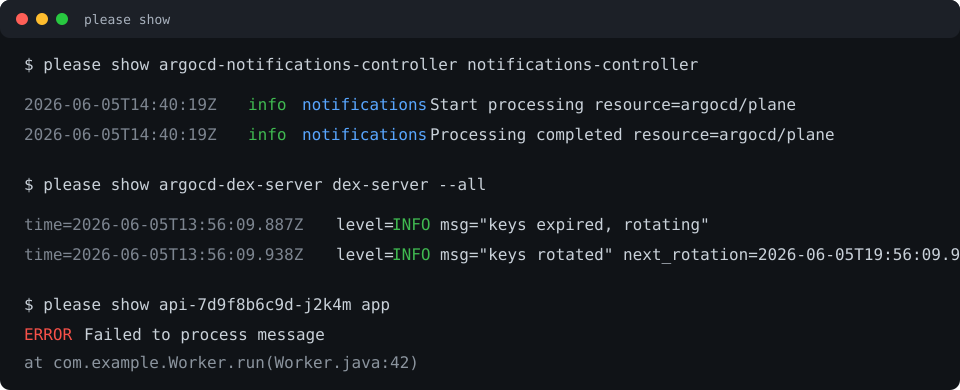

# fucking-kubectl

Polite and impolite Kubernetes shortcuts for the things you actually do to pods.

`please` is for polite society: logs, shells, restarts, and regular deletes.
`fucking` is for when polite society has failed: force-delete it now.

```sh
please stop api-7d9f8b6c9d-j2k4m
fucking die api-7d9f8b6c9d-j2k4m
```

Both commands use your active `kubectl` context and namespace. No namespace flags are added for you.

## Why

The joke gets you in the door; the useful part is less typing for the Kubernetes commands you run all day.

- pod and container completion for log and shell commands
- readable log output for JSON and common plaintext log formats
- normal deletes through `please`, forced deletes through `fucking`
- explicit namespace/context flags when you need them

For example:

```sh
please follow api-7d9f8b6c9d-j2k4m app
# kubectl logs -f api-7d9f8b6c9d-j2k4m -c app
```

`please show` and `please follow` keep normal plaintext logs readable, but make structured logs much easier to scan:



- timestamps are dimmed
- log levels are colored by severity
- logger names are highlighted
- JSON stack traces are printed under the log message
- stack traces and unparsed continuation lines get a subtle muted tint
- existing ANSI colors in log messages are preserved

If `jq` is not installed, logs pass through unchanged.

## Commands

### `please`

```sh
please [KUBECTL_FLAGS] stop POD
```

Delete a pod normally.

Equivalent:

```sh
kubectl [KUBECTL_FLAGS] delete pod POD
```

```sh
please [KUBECTL_FLAGS] nope TYPE NAME
```

Delete any namespaced resource normally.

Equivalent:

```sh
kubectl [KUBECTL_FLAGS] delete TYPE NAME
```

```sh
please [KUBECTL_FLAGS] restart DEPLOYMENT
```

Run a deployment rollout restart.

Equivalent:

```sh
kubectl [KUBECTL_FLAGS] rollout restart deployment DEPLOYMENT
```

```sh
please [KUBECTL_FLAGS] why POD
please [KUBECTL_FLAGS] sherlock POD
```

Show a focused pod diagnosis:

```sh
kubectl get pod POD -o wide
kubectl get events --field-selector involvedObject.name=POD --sort-by=.lastTimestamp
kubectl logs POD --previous --tail=200
```

```sh
please [KUBECTL_FLAGS] invade POD [CONTAINER]
```

Open an interactive shell in a pod. It tries `zsh`, then `bash`, then `sh`.

Equivalent:

```sh
kubectl [KUBECTL_FLAGS] exec -it POD [-c CONTAINER] -- zsh
kubectl [KUBECTL_FLAGS] exec -it POD [-c CONTAINER] -- bash
kubectl [KUBECTL_FLAGS] exec -it POD [-c CONTAINER] -- sh
```

It uses the first shell found in the pod.

```sh
please [KUBECTL_FLAGS] show POD [CONTAINER] [--all]
```

Show recent pod logs. JSON log lines get readable field formatting; plaintext log lines pass through unchanged.

Equivalent:

```sh
kubectl [KUBECTL_FLAGS] logs --tail=200 POD [-c CONTAINER]
```

With `--all`:

```sh
kubectl [KUBECTL_FLAGS] logs POD [-c CONTAINER]
```

```sh
please [KUBECTL_FLAGS] follow POD [CONTAINER]
```

Follow pod logs with the same log formatting behavior.

Equivalent:

```sh
kubectl [KUBECTL_FLAGS] logs -f POD [-c CONTAINER]
```

### `fucking`

```sh
fucking [KUBECTL_FLAGS] die POD
```

Force-delete a pod immediately.

Equivalent:

```sh
kubectl [KUBECTL_FLAGS] delete pod POD --grace-period=0 --force
```

```sh
fucking [KUBECTL_FLAGS] nope TYPE NAME
```

Force-delete any namespaced resource immediately.

Equivalent:

```sh
kubectl [KUBECTL_FLAGS] delete TYPE NAME --grace-period=0 --force
```

## Kubectl flags

`[KUBECTL_FLAGS]` means a small set of kubectl selection flags that must come immediately after `please` or `fucking`, before the funny command word.

Supported flags:

```text
-n, --namespace NAME
--namespace=NAME
--context NAME
--context=NAME
--kubeconfig PATH
--kubeconfig=PATH
```

Correct:

```sh
please -n hermes stop api-7d9f8b6c9d-j2k4m
please --namespace=ai invade open-webui-0
fucking --context prod die api-7d9f8b6c9d-j2k4m
```

Not supported:

```sh
please stop -n hermes api-7d9f8b6c9d-j2k4m
please invade open-webui-0 -n ai
fucking die api-7d9f8b6c9d-j2k4m --context prod
```

This is intentionally stricter than `kubectl`: command-specific arguments stay simple, and kubectl selection flags always live in one predictable place.

## Completion

Zsh and Bash completions are included for both commands.

They complete:

- command names
- pods in the current namespace
- dynamic deletable resource types from `kubectl api-resources --verbs=delete --namespaced=true -o name`
- resource names for `please nope` and `fucking nope`
- container names for `please invade POD CONTAINER`, `please show POD CONTAINER`, and `please follow POD CONTAINER`
- `--all` for `please show POD [CONTAINER] --all`

Zsh completion does not require oh-my-zsh. It only needs zsh completion via `compinit`.

Bash completion uses the standard `bash-completion` mechanism.

## Install

Clone the repo:

```sh
git clone https://github.com/paulharkink/fucking-kubectl.git
cd fucking-kubectl
./install.sh
```

The installer symlinks:

```text
~/.local/bin/please
~/.local/bin/fucking
~/.local/bin/fucking-kubectl
```

Make sure `~/.local/bin` is on your `PATH`.

It does not install shell completions automatically.

### Zsh completion

Install the completion files:

```sh
mkdir -p "$HOME/.zsh/completions"
fucking-kubectl completion zsh please > "$HOME/.zsh/completions/_please"
fucking-kubectl completion zsh fucking > "$HOME/.zsh/completions/_fucking"
```

If `fucking-kubectl` is not on your `PATH` yet, use `~/.local/bin/fucking-kubectl`.

Add this to `~/.zshrc` if you do not already have a zsh completion setup:

```sh
fpath=("$HOME/.zsh/completions" $fpath)
autoload -Uz compinit
compinit
```

For oh-my-zsh users, put the `fpath` line before:

```sh
source $ZSH/oh-my-zsh.sh
```

### Bash completion

Install the completion files:

```sh
mkdir -p "$HOME/.local/share/bash-completion/completions"
fucking-kubectl completion bash > "$HOME/.local/share/bash-completion/completions/please"
fucking-kubectl completion bash > "$HOME/.local/share/bash-completion/completions/fucking"
```

For Bash users, make sure `bash-completion` is installed and sourced. Many Linux distributions do this automatically. If not, add the appropriate line for your system to `~/.bashrc`, for example:

```sh
[ -f /usr/share/bash-completion/bash_completion ] && . /usr/share/bash-completion/bash_completion
```

On Homebrew:

```sh
[[ -r "$(brew --prefix)/etc/profile.d/bash_completion.sh" ]] && . "$(brew --prefix)/etc/profile.d/bash_completion.sh"
```

## oh-my-zsh plugin style

You can also install it as a custom oh-my-zsh plugin:

```sh
git clone https://github.com/paulharkink/fucking-kubectl.git \
  ${ZSH_CUSTOM:-$HOME/.oh-my-zsh/custom}/plugins/fucking-kubectl
```

Then add it to `~/.zshrc`:

```sh
plugins=(... fucking-kubectl)
```

The plugin file adds `bin/` to `PATH` and `completions/` to `fpath`.

## Examples

```sh
please restart api
# kubectl rollout restart deployment api

please why api-7d9f8b6c9d-j2k4m
# kubectl get pod api-7d9f8b6c9d-j2k4m -o wide
# kubectl get events --field-selector involvedObject.name=api-7d9f8b6c9d-j2k4m --sort-by=.lastTimestamp
# kubectl logs api-7d9f8b6c9d-j2k4m --previous --tail=200

please invade api-7d9f8b6c9d-j2k4m app
# kubectl exec -it api-7d9f8b6c9d-j2k4m -c app -- zsh
# or bash, then sh, depending on what exists in the container

please show api-7d9f8b6c9d-j2k4m app
# kubectl logs --tail=200 api-7d9f8b6c9d-j2k4m -c app

please follow api-7d9f8b6c9d-j2k4m app
# kubectl logs -f api-7d9f8b6c9d-j2k4m -c app

please show api-7d9f8b6c9d-j2k4m app --all
# kubectl logs api-7d9f8b6c9d-j2k4m -c app

please nope deployments.apps api
# kubectl delete deployments.apps api

fucking nope jobs.batch import-123
# kubectl delete jobs.batch import-123 --grace-period=0 --force
```

## Requirements

- `kubectl`
- `jq` for readable log formatting in `please show`, `please follow`, and `please why`; without it, logs pass through unchanged
- `zsh` or Bash for completions
- `bash-completion` for Bash completions
- enough Kubernetes permissions for whatever you ask the commands to do

The commands themselves are small Bash scripts.

## Test

```sh
./test.sh
```

The test runner covers log formatting, command translation, installer behavior,
completion script smoke tests, and shell syntax checks. If `shellcheck` or
`shfmt` are installed, it runs those too.

Tekton Pipelines as Code runs the same entrypoint on pull requests and main
pushes. CI installs `shellcheck`, so linting is enforced there even when it is
optional locally.
